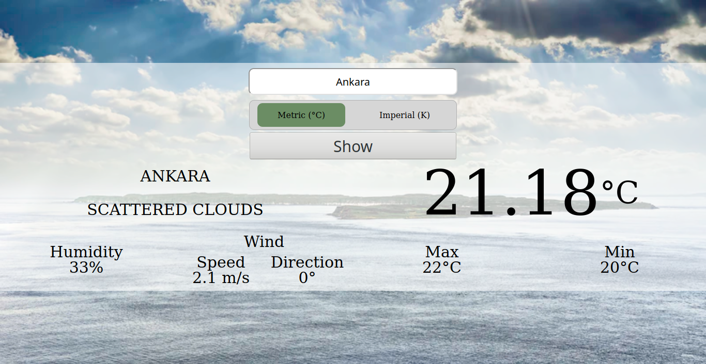

# Weather App 

> This is the fourth project of Microverse JavaScript course.

> Weather App!

## Description

In this project, a weather app is built.

Different weather properties like tepmerature,wind of any city can be checked by using this app. Results are shown by using related weather conditions.

## Features

A weather API is used to get informations.

## Built with

- Git
- HTML
- CSS
- JavaScript
- webpack
- Sass

## Live demo

Please [check](https://rawcdn.githack.com/ozovalihasan/weather-app/af5635c00d147166428ed9cc3ebf6a94ed72b98a/dist/index.html).

## Setup

- Clone this repository
- Open terminal
- Change directory by using `cd weather-app/`
- Run `npm install`

Then,

- Run `npm run start`
- Open your browser and go to 'http://localhost:8080' and open 'dist' folder

## Authors

Reach out to me at one of the following places!

👤 **Hasan Özovalı**

- LinkedIn: [Hasan Ozovali](https://www.linkedin.com/in/hasan-ozovali/)
- Github: [@ozovalihasan](https://github.com/ozovalihasan)
- Twitter: [@ozovalihasan](https://twitter.com/ozovalihasan)
- Mail: [ozovalihasan@gmail.com](ozovalihasan@gmail.com)

## Contributing 🤝

Contributions, issues, and feature requests are welcome!

Feel free to check the [issues page](https://github.com/ozovalihasan/weather-app/issues).

## Acknowledgments

Thanks to

- [Microverse](http://microverse.org/) for its support.
- Members of [Unsplash](https://unsplash.com/) for amazing pictures.

## Show your support

Give a ⭐️ if you like this project!

## License

- **[MIT license](http://opensource.org/licenses/mit-license.php)**
